# Инструкция по сборке бота в salebot.pro

Документ — пошаговая визуальная инструкция: как разложить сценарии бота «Голден Дент» в редакторе salebot.pro. Каждый сценарий = одна блок-схема (рендерится на GitHub автоматически) + список блоков, кнопок и действий, которые надо создать в кабинете.

> **Условные обозначения на схемах**
> - Прямоугольник — сообщение бота
> - Ромб — условие (проверка переменной/тега)
> - «Стадион» (закруглённые края) — триггер запуска сценария
> - Параллелограмм — действие (запись переменной, постановка тега, отложенный таймер)
> - Подпись на стрелке — кнопка / ответ пользователя
> - Пунктирная стрелка — переход на URL (внешняя ссылка)

---

## Перед стартом сборки

1. Создать в кабинете **переменные клиента** (Раздел «Переменные»):
   `consent_given_at`, `fio`, `phone`, `birth_date`, `last_visit_date`, `appointment_date`, `appointment_status`, `appointment_cancel_reason`, `not_ready_comment`, `last_remind_status`.

2. Создать **глобальные переменные** (Раздел «Глобальные переменные»):
   `clinic_name`, `birthday_bonus_amount`, `admin_book_url`, `admin_contact_url`, `admin_birthday_url`, `consent_policy_url`, `consent_rules_url`, `start_text`, `start_image`, `about_text`, `about_image`, `special_offers_header`, `offer_1_*` … `offer_5_*` (title/text/image/book_url/buy_url).

3. Создать **списки** (Раздел «Списки»):
   `Не готов записаться`, `Отмены записи`, `Не доставлено`.

4. Создать **теги** (Раздел «Теги»):
   `consent_given`, `registered`, `appointment_tomorrow`, `birthday_today`, `remind_3m_due`, `remind_6m_due`.

После подготовки этих объектов — собирать сценарии ниже по порядку.

---

## Сценарий 1. Старт + согласие + регистрация

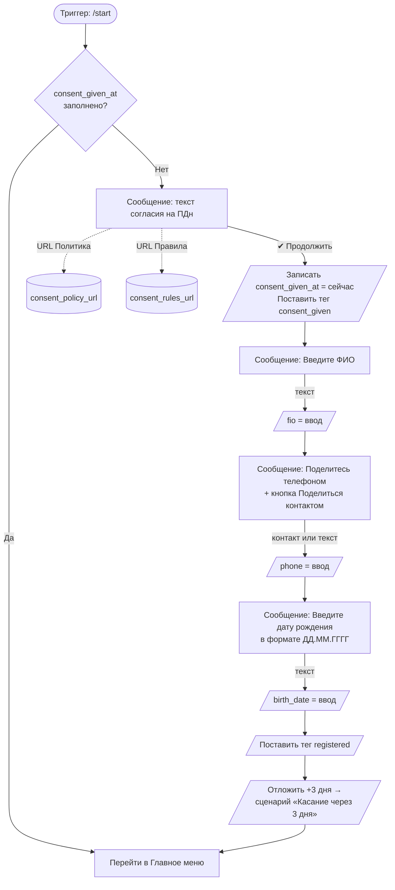

**Блоки, которые надо создать в редакторе:**

| № | Блок | Содержимое | Кнопки / действия |
|---|---|---|---|
| 1.1 | Условие | Если `consent_given_at` непустое → блок 2.1 «Главное меню» | — |
| 1.2 | Сообщение «Согласие» | Текст из переменной `consent_text` (см. ниже) | 3 кнопки: ✔ Продолжить (→1.3), Политика ПДн (URL `consent_policy_url`), Правила (URL `consent_rules_url`) |
| 1.3 | Действие | `consent_given_at = now()`, тег `consent_given` | → 1.4 |
| 1.4 | Сообщение | «Введите ваше ФИО» | Ожидание ввода → 1.5 |
| 1.5 | Действие | `fio = #{ввод}` | → 1.6 |
| 1.6 | Сообщение | «Поделитесь номером телефона» | Кнопка «📱 Поделиться контактом» (Telegram contact) или ввод текстом → 1.7 |
| 1.7 | Действие | `phone = #{ввод/контакт}` | → 1.8 |
| 1.8 | Сообщение | «Введите дату рождения в формате ДД.ММ.ГГГГ» | Ожидание ввода → 1.9 |
| 1.9 | Действие | `birth_date = #{ввод}`, тег `registered`, отложить +3 дня → сценарий 5 | → 2.1 |

**Текст для блока 1.2 (`consent_text`):**
```
Добро пожаловать в чат-бот клиники.
Для продолжения нажмите «Продолжить».
Нажимая кнопку, вы даёте согласие на обработку ваших персональных
данных (ФИО, номер телефона, дата рождения) для:
• ведения базы пациентов
• связи с вами
• отправки сервисных сообщений, включая поздравления и подарки
  в день рождения.
```

---

## Сценарий 2. Главное меню

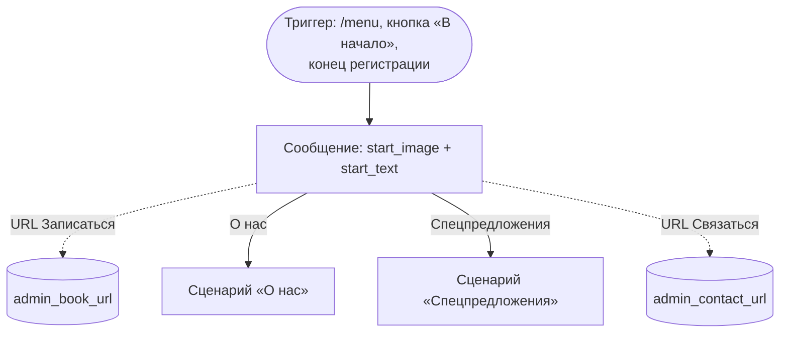

| № | Блок | Содержимое | Кнопки |
|---|---|---|---|
| 2.1 | Сообщение | Фото `start_image` + текст `start_text` | 4 кнопки: «Записаться на приём» (URL `admin_book_url`), «О нас» (→3.1), «Спецпредложения» (→4.1), «Связаться с администратором» (URL `admin_contact_url`) |

---

## Сценарий 3. О нас

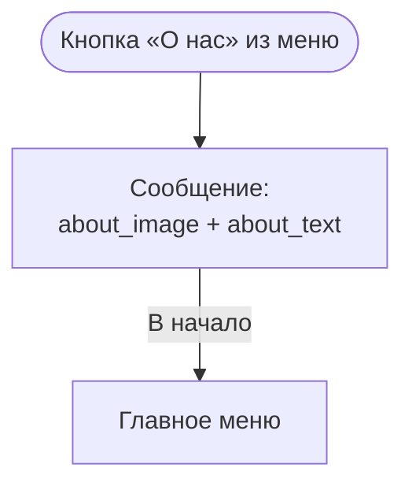

| № | Блок | Содержимое | Кнопки |
|---|---|---|---|
| 3.1 | Сообщение | Фото `about_image` + текст `about_text` | 1 кнопка: «В начало» → 2.1 |

---

## Сценарий 4. Спецпредложения

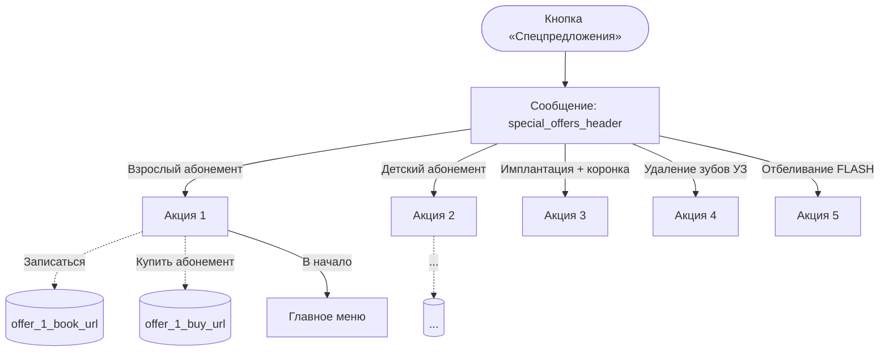

| № | Блок | Содержимое | Кнопки |
|---|---|---|---|
| 4.1 | Сообщение | Текст `special_offers_header` | 5 кнопок (по числу акций) → 4.2…4.6 |
| 4.2 | Акция 1 | Фото `offer_1_image` + текст `offer_1_text` | «Записаться» (URL `offer_1_book_url`), «Купить абонемент» (URL `offer_1_buy_url`, показывать только если переменная заполнена), «В начало» → 2.1 |
| 4.3–4.6 | Акции 2–5 | Аналогично 4.2, переменные `offer_2_*` … `offer_5_*` | — |

---

## Сценарий 5. Касание через 3 дня

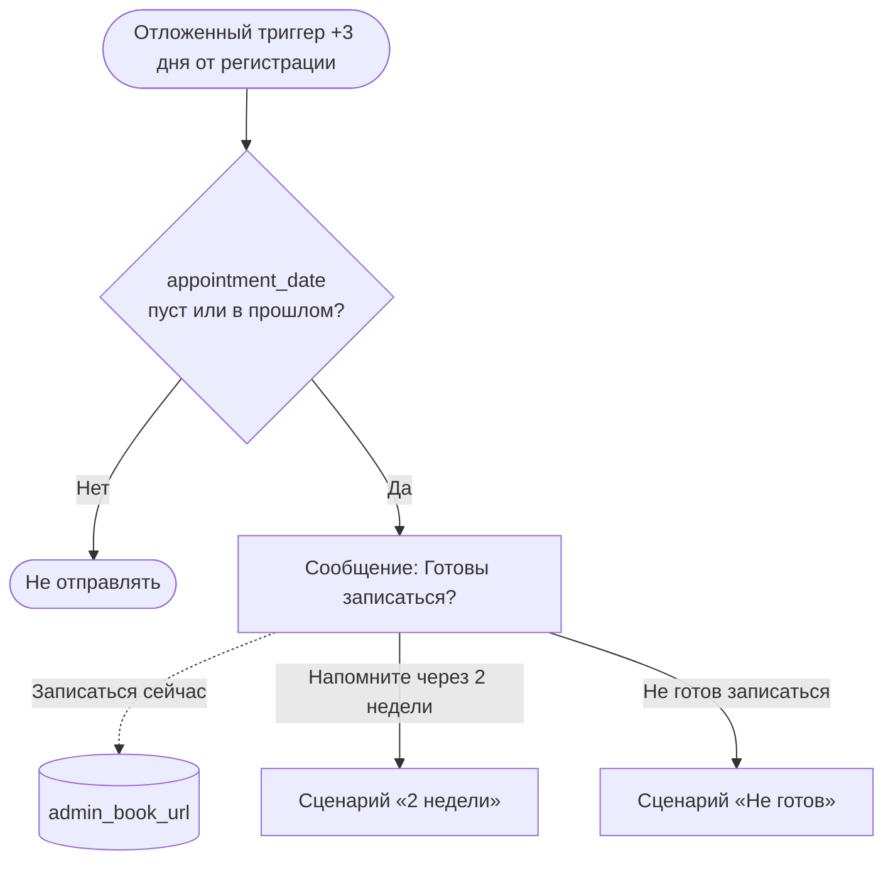

| № | Блок | Содержимое | Кнопки |
|---|---|---|---|
| 5.1 | Условие | Если `appointment_date` пуст или меньше сегодня → 5.2 | — |
| 5.2 | Сообщение | «Здравствуйте! Готовы записаться на приём?» | 3 кнопки: «Записаться сейчас» (URL `admin_book_url`), «Напомните через 2 недели» → 6.1, «Не готов записаться» → 7.1 |

---

## Сценарий 6. Напомните через 2 недели

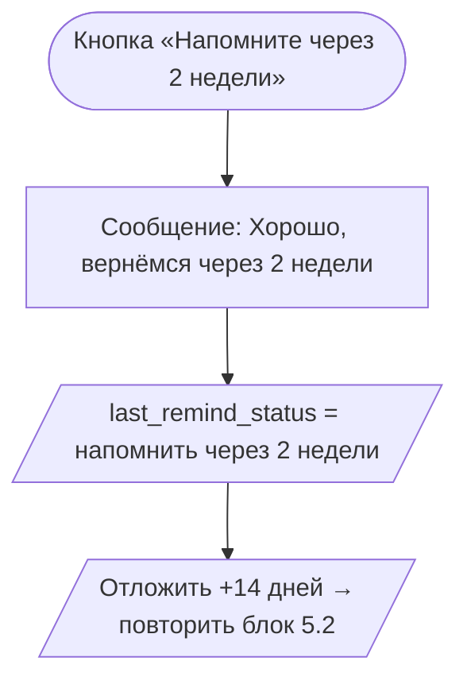

| № | Блок | Содержимое | Действия |
|---|---|---|---|
| 6.1 | Сообщение | «Хорошо, вернёмся через 2 недели. Хорошего дня!» | `last_remind_status = "напомнить через 2 недели"`, отложить +14 дней → 5.2 |

---

## Сценарий 7. Не готов записаться

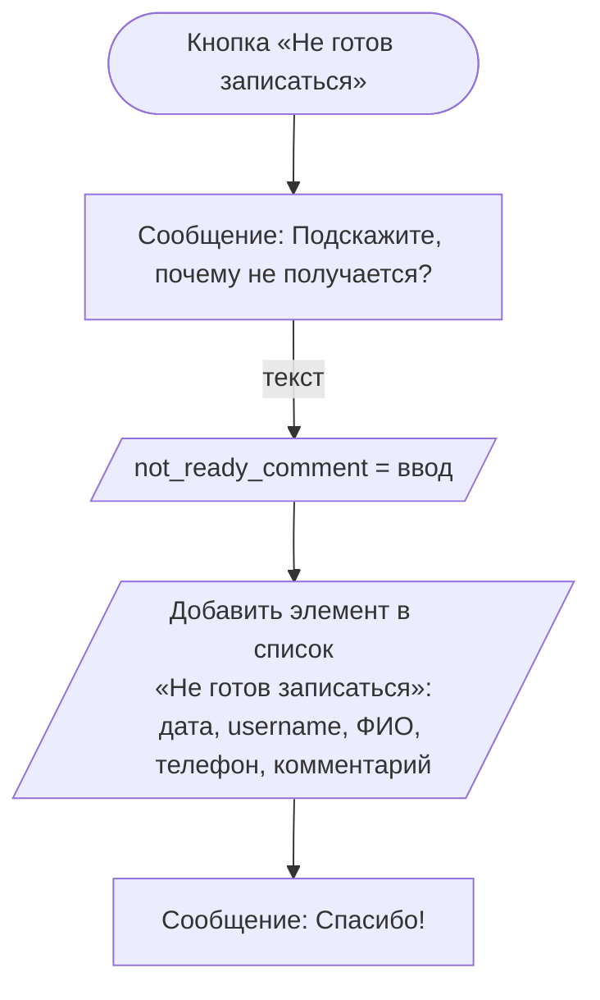

| № | Блок | Содержимое | Действия |
|---|---|---|---|
| 7.1 | Сообщение | «Подскажите, пожалуйста, почему не получается?» | Ожидание текста → 7.2 |
| 7.2 | Действие | `not_ready_comment = #{ввод}`, добавить запись в список `Не готов записаться` со столбцами: дата+время, `tg_username`, `fio`, `phone`, `not_ready_comment` | → 7.3 |
| 7.3 | Сообщение | «Спасибо! Мы учтём ваш ответ.» | — |

---

## Сценарий 8. Напоминание о записи на завтра

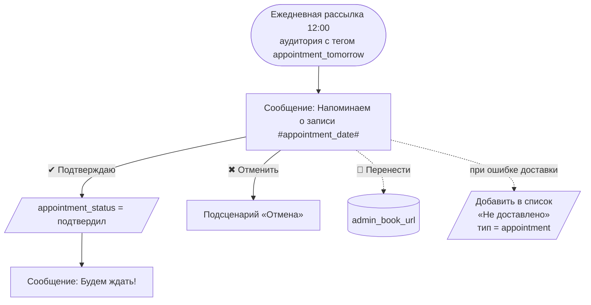

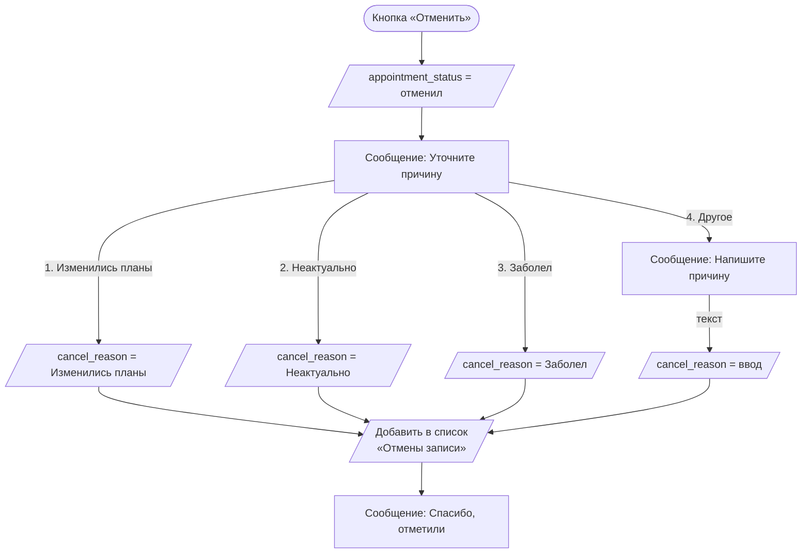

| № | Блок | Содержимое | Кнопки / действия |
|---|---|---|---|
| 8.1 | Сообщение | «Здравствуйте, #fio#! Напоминаем о вашей записи #appointment_date# в клинику «#clinic_name#».» | 3 кнопки: «✔ Подтверждаю» → 8.2, «✖ Отменить» → 8.4, «🔁 Перенести запись» (URL `admin_book_url`) |
| 8.2 | Действие | `appointment_status = "подтвердил"` | → 8.3 |
| 8.3 | Сообщение | «Отлично, будем ждать!» | — |
| 8.4 | Действие | `appointment_status = "отменил"` | → 8.5 |
| 8.5 | Сообщение | «Уточните, пожалуйста, причину отмены:» | 4 кнопки: 1, 2, 3, «Другое» → 8.6 / 8.7 / 8.8 / 8.9 |
| 8.6 | Действие | `appointment_cancel_reason = "Изменились планы"` | → 8.10 |
| 8.7 | Действие | `appointment_cancel_reason = "Неактуально"` | → 8.10 |
| 8.8 | Действие | `appointment_cancel_reason = "Заболел"` | → 8.10 |
| 8.9 | Сообщение | «Напишите, пожалуйста, причину отмены в свободной форме» | Ожидание текста → `appointment_cancel_reason = #{ввод}` → 8.10 |
| 8.10 | Действие | Добавить элемент в список `Отмены записи` (дата, username, ФИО, телефон, дата записи, причина) | → 8.11 |
| 8.11 | Сообщение | «Спасибо, отметили отмену записи.» | — |

**Как ставится тег `appointment_tomorrow`:**
В кабинете salebot настроить ежедневную задачу (или массовую операцию по списку клиентов) в 11:00 — для всех клиентов, у кого `appointment_date` приходится на завтра, поставить тег `appointment_tomorrow`. После рассылки в 12:00 тег снимается.

---

## Сценарий 9. Напоминание через 3 / 6 месяцев

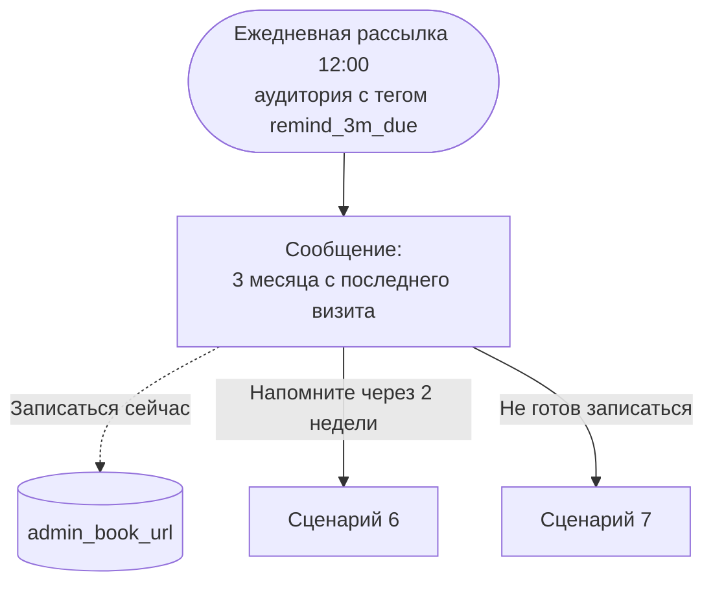

| № | Блок | Содержимое | Кнопки |
|---|---|---|---|
| 9.1 | Сообщение (3 мес) | «Здравствуйте, #fio#! С момента вашего последнего визита в «#clinic_name#» прошло 3 месяца — рекомендуем профессиональную гигиену и осмотр.» | 3 кнопки как в 5.2 |
| 9.2 | Сообщение (6 мес) | Аналогично, но «6 месяцев» и «оптимальное время для профилактического осмотра» | 3 кнопки как в 5.2 |

**Как ставятся теги `remind_3m_due` / `remind_6m_due`:**
Ежедневно в 11:00 — для всех клиентов, у кого `last_visit_date + 3 (или 6) месяцев = сегодня`, поставить соответствующий тег.

---

## Сценарий 10. Поздравление с днём рождения

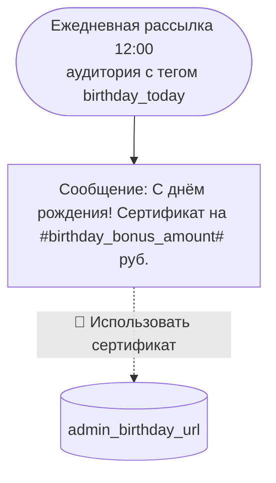

| № | Блок | Содержимое | Кнопки |
|---|---|---|---|
| 10.1 | Сообщение | «🎉 #fio#, с днём рождения! От клиники «#clinic_name#» дарим вам подарочный сертификат на #birthday_bonus_amount# руб. на любые услуги.» | 1 кнопка: «🎁 Использовать сертификат» (URL `admin_birthday_url`) |

**Как ставится тег `birthday_today`:**
Ежедневно в 11:00 — для всех клиентов, у кого день и месяц `birth_date` = сегодня, поставить тег `birthday_today`. На следующий день тег снимается автоматически.

---

## Общая карта связей сценариев

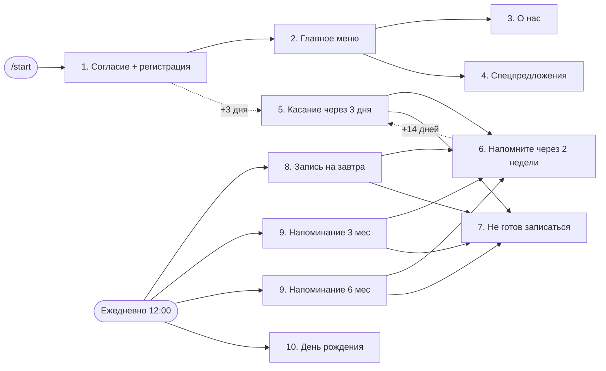

---

## Чек-лист сборки

**Этап 1. Подготовка кабинета (1 день)**
- [ ] Подключить Telegram-бот к кабинету (получить токен у @BotFather, привязать)
- [ ] Часовой пояс кабинета: Asia/Novosibirsk
- [ ] Создать переменные клиента (12 шт.)
- [ ] Создать глобальные переменные (13 общих + по 5 на каждую акцию)
- [ ] Заполнить начальные значения глобальных переменных (тексты, фото, ссылки)
- [ ] Создать 3 списка
- [ ] Создать 6 тегов

**Этап 2. Базовые сценарии (3–4 дня)**
- [ ] Сценарий 1 (старт + регистрация) — пройти `/start` от тестового аккаунта
- [ ] Сценарий 2 (главное меню) — все 4 кнопки работают
- [ ] Сценарий 3 (О нас) — фото и текст подгружаются из переменных
- [ ] Сценарий 4 (Спецпредложения) — 5 акций, у каждой работают кнопки

**Этап 3. Касание и развилки (2 дня)**
- [ ] Сценарий 5 (через 3 дня) — отложенный триггер срабатывает; условие на `appointment_date` отрабатывает
- [ ] Сценарий 6 (через 2 недели) — повторное сообщение через 14 дней
- [ ] Сценарий 7 (не готов) — комментарий записывается в список

**Этап 4. Ежедневные рассылки (3 дня)**
- [ ] Задача в 11:00 ставит теги `appointment_tomorrow`, `birthday_today`, `remind_3m_due`, `remind_6m_due`
- [ ] Сценарий 8 (запись на завтра) — рассылка в 12:00 по тегу; все 3 кнопки работают; отмена с 4 причинами; ветки записывают в списки
- [ ] Сценарий 9 (3 / 6 мес) — рассылки в 12:00 по тегам
- [ ] Сценарий 10 (день рождения) — рассылка в 12:00 по тегу

**Этап 5. Импорт и обучение (2 дня)**
- [ ] Импорт базы клиентов из CSV (поля: `tg_username`, `fio`, `phone`, `birth_date`, `last_visit_date`)
- [ ] Демо для Заказчика — пройти все 17 тест-кейсов из ТЗ
- [ ] Передать инструкцию администратору

---

## Шпаргалка по подстановке переменных в текст

В salebot.pro переменные подставляются в сообщения в формате `#имя_переменной#`. Например:

- `«Здравствуйте, #fio#!»` → `«Здравствуйте, Иван Петров!»`
- `«Сертификат на #birthday_bonus_amount# руб.»` → `«Сертификат на 1000 руб.»`
- `«Запись #appointment_date# в #clinic_name#»` → `«Запись 03.05.2026 14:00 в Голден Дент»`

Если переменная пустая — лучше делать ветвь «если пусто, отправить общий текст без имени».

---

## Что стоит проверить до сдачи

1. Все тексты, фото и ссылки взяты из глобальных переменных — никаких хардкодов в блоках.
2. У каждой ежедневной рассылки есть ветка «при ошибке доставки» → запись в список `Не доставлено`.
3. Условие в сценарии 5 действительно фильтрует клиентов, которые уже записались (иначе будут лишние касания).
4. После отправки напоминания о записи на завтра тег `appointment_tomorrow` снимается, чтобы рассылка не уходила повторно.
5. CSV-импорт корректно обновляет переменные у уже существующих клиентов (а не создаёт дубликаты).
